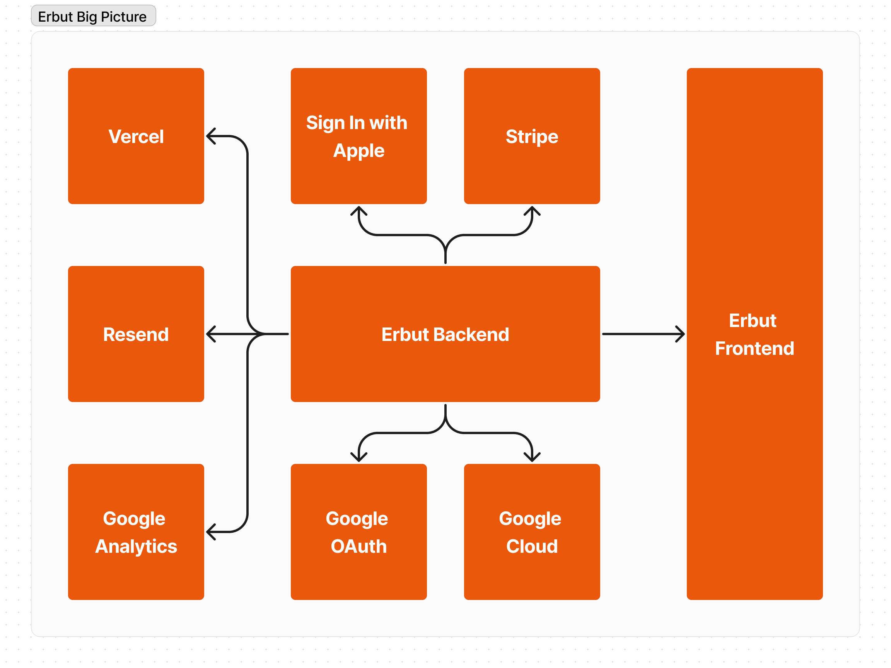
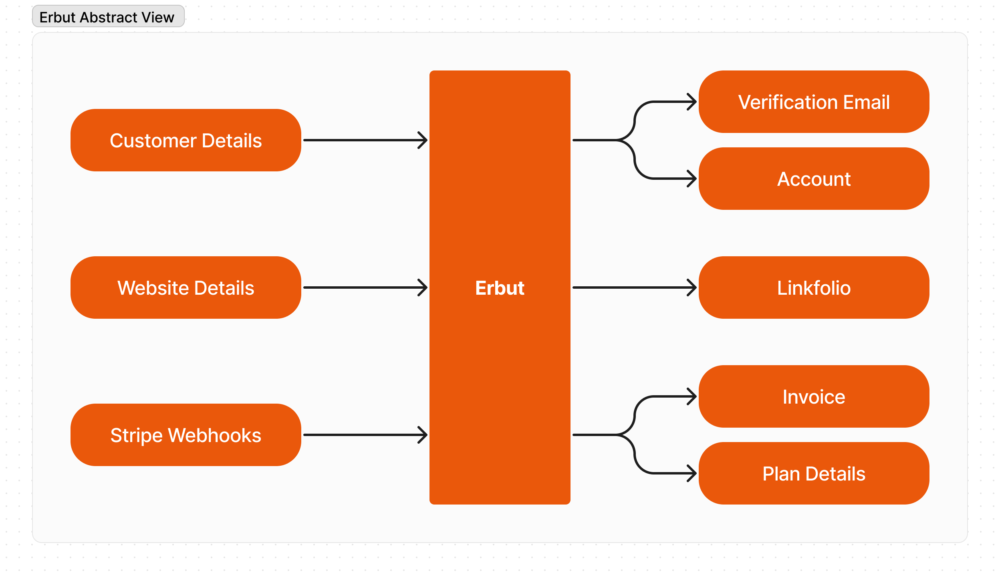
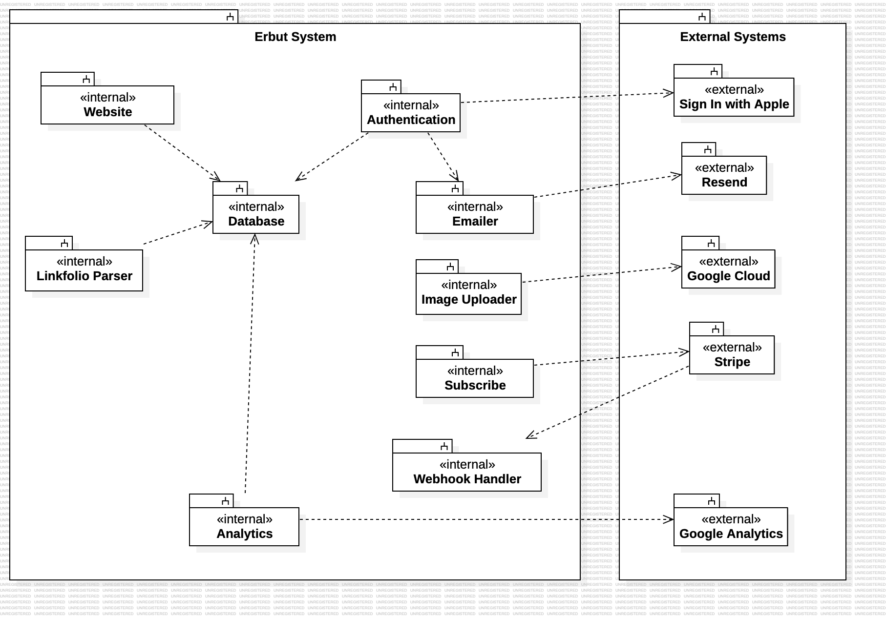
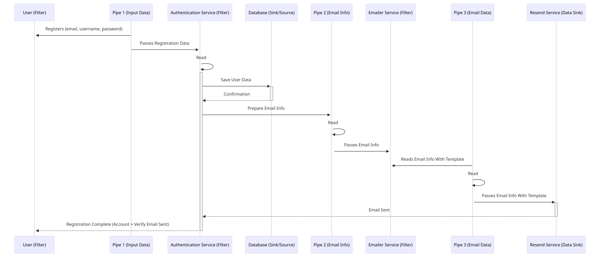
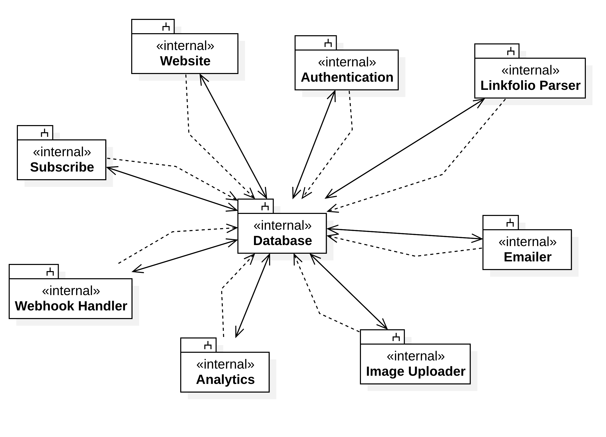

# **Erbut**: An Elegant Web-Based Linkfolio

_Yazeed AlKhalaf, Khalil Melhem, Khaled Hazzam_  
_SWE 302 - Software Design & Architecture_  
_Dr. Ahmed Ghoneim, Instructor_  
_25 Mar, 2024_

---

## Introduction

Erbut offers a dynamic, web-based platform for creating 'Erbuts'—personalized linkfolios. These elegant portfolios showcase curated links, supporting both subdomains and custom domains. Integration with Google Analytics and a subscription model via Stripe enhance the user experience, making Erbut a versatile solution for professional and personal online presence.

---

## System Overview

Erbut's architecture integrates with various services such as **Vercel, Stripe, Google Analytics**, and more, providing a scalable backend and user-friendly frontend. This section uses UML diagrams for a high-level understanding.

---

## Big Picture

---

## Abstract View

---

## Subsystem View

Displays internal and external components of Erbut, showcasing the modularity and integration capabilities of the system.

---

## Functionalities of The Subsystems

Detailing internal subsystems like **Database, Authentication, Website & Linkfolio Parser, Emailer, Image Uploader**, and external subsystems including **Google Analytics, Google Cloud**, and **Stripe**.

---

## Key Internal Subsystems

- **Database:** Stores customer and website data.
- **Authentication:** Manages user login, integrating with **Google OAuth** and **Sign in with Apple**.
- **Website & Linkfolio Parser:** Customizes linkfolios based on database data.

---

## Data Flow Diagrams

### Batch Sequential & Pipe and Filter

Diagrams showcasing the subscription process and user registration data flow, highlighting steps from payment to subscription activation and user registration to email verification.

---

## Batch Sequential Process

Explains the subscription process from payment info to Stripe payment processing and subscription activation.

---

## Pipe and Filter Process

Details the user registration process, from data input through authentication to email verification.

---

## Architecture Deep Dive

- **Layered Architecture:** Divides the system into **Presentation, Application, and Data layers**.
- **MVC Architecture:** Utilizes Model-View-Controller pattern in frontend development with React and Zustand for state management.

---

## Layered Architecture

Showcases the separation into presentation, application, and data layers, each responsible for specific functionalities within Erbut.

---

## MVC in Action

Highlights the MVC pattern in frontend development, emphasizing the connection between the model, view, and controller components.

---

## Repository Diagram

Illustrates centralized data management and subsystem interactions, underlining the significance of the central database in facilitating efficient data flow.

---

## Conclusion

Erbut combines scalable architecture with user-centric design, employing a layered structure and MVC pattern for a unique online presence. Its integration with key external services enhances functionality and user experience.
