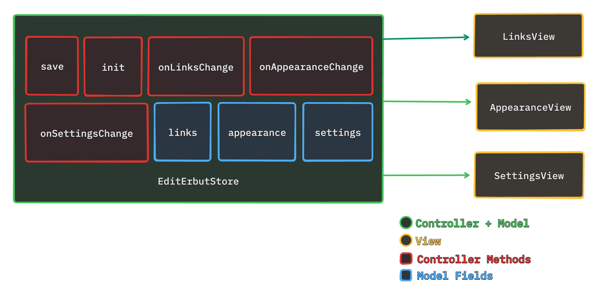

# **Erbut**: An Elegant Web-Based Linkfolio

---

## Introduction

- **What is Erbut?** A platform for creating 'Erbuts'—elegant, personalized linkfolios.
- **Creators:** Yazeed AlKhalaf, Khalil Melhem, Khaled Hazzam
- **Course:** SWE 302 - Software Design & Architecture
- **Instructor:** Dr. Ahmed Ghoneim
- **Date:** 25 Mar, 2024

---

# System Overview

---

## Big Picture

A glance at Erbut's architecture, integrated with **Vercel, Stripe, Google Analytics**, and more.

---

## Abstract View

- **Inputs:** Customer Details, Website Details
- **Outputs:** Erbut Linkfolio

---

## Subsystem View

Highlighting both **Internal** and **External** Components, focusing on modularity and integration.

---

# Subsystem Functionalities

Discussing the functionalities of **Database, Authentication, Website**, and **External Services** like Google Cloud and Stripe.

---

## Key Internal Subsystems

- **Database:** For customer and website data.
- **Authentication:** For user login and security.
- **Website & Linkfolio Parser:** For creating and customizing linkfolios.
- **Emailer & Image Uploader:** For enhancing user engagement.

---

## Key External Subsystems

- **Google Analytics:** For visitor tracking.
- **Stripe:** For payment processing.
- **Resend:** For email automation.

---

# Data Flow Diagrams

---

## Batch Sequential

From **payment information** to **subscription activation**.

---

## Pipe and Filter

Visualizing the **user registration** data journey.

---

# Architecture Deep Dive

---

## Layered Architecture

Detailing the **Presentation, Application, and Data layers**.

---

## MVC in Action

Exploring the **Model-View-Controller** pattern in our frontend development.

---

# Repository Diagram

Detailing **data management** and subsystem interactions.

---

## Conclusion

**Erbut** blends scalable architecture with user-centric design for a unique online presence.
